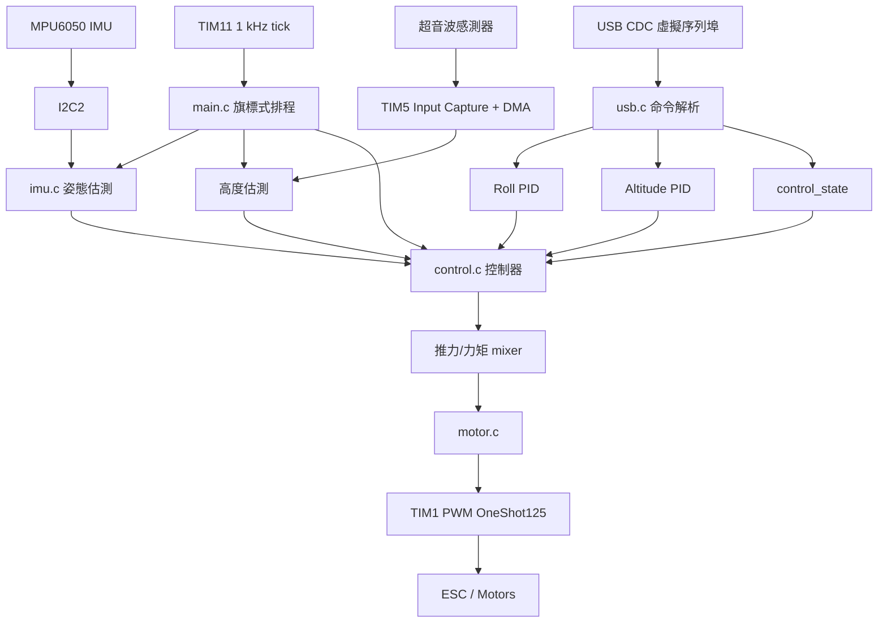
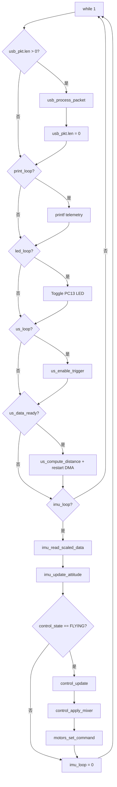

# BP Stabilization Students

這是一個以 STM32F411CEU6 為核心的雙旋翼穩定控制教學專案。專案由 STM32CubeIDE / STM32CubeMX 產生基礎工程，並在 `Core` 內加入 IMU、超音波測距、PID 控制、馬達 OneShot125 輸出與 USB CDC 命令介面，用來實作 bicopter 在滾轉角與高度方向上的基礎穩定。

本文件以「接手此專案的人能快速建立全貌」為目標，說明目前程式碼的架構、資料流、控制設計、硬體設定與實作細節。

## 專案概觀

### 目標

- 使用 MPU6050 讀取加速度計與陀螺儀資料。
- 以互補濾波估測機體姿態，主要使用 `roll` 做穩定控制。
- 使用超音波感測器量測距離，並依姿態角投影成近似垂直高度。
- 使用兩組 PID 分別控制高度與滾轉角。
- 將控制量轉換為左右兩顆馬達的推力命令。
- 透過 TIM1 PWM 輸出 OneShot125 訊號給 ESC。
- 透過 USB CDC 虛擬序列埠接收命令、調整 PID、啟停飛行狀態與輸出除錯資訊。

### 目標平台

- MCU：STM32F411CEU6 / STM32F411CEUx
- Toolchain：STM32CubeIDE，GCC
- Firmware package：STM32Cube FW_F4 V1.28.3
- 主要外設：
  - I2C2：MPU6050
  - TIM1：兩路 PWM，輸出 OneShot125 ESC 訊號
  - TIM2：微秒級 blocking delay
  - TIM5：超音波 echo input capture，搭配 DMA
  - TIM11：1 kHz 主排程 tick
  - USB OTG FS：CDC device，作為虛擬 COM port

## 目錄結構

```text
.
├── BP_Stabilization_students.ioc       # STM32CubeMX 設定檔
├── STM32F411CEUX_FLASH.ld              # Flash linker script
├── STM32F411CEUX_RAM.ld                # RAM linker script
├── Core
│   ├── Inc                             # 專案 header 與 CubeMX 產生的外設宣告
│   │   ├── control.h                   # 控制常數、控制輸入與狀態
│   │   ├── imu.h                       # IMU 資料結構與姿態估測介面
│   │   ├── motor.h                     # ESC/OneShot125 命令定義
│   │   ├── mpu6050.h                   # MPU6050 register、比例係數與 offset
│   │   ├── pid.h                       # PID 結構與 API
│   │   ├── ultrasonic_sensor.h         # 超音波感測 API
│   │   └── usb.h                       # USB 命令封包與處理 API
│   ├── Src
│   │   ├── main.c                      # 初始化、主迴圈、排程 callback
│   │   ├── control.c                   # 高度/roll 控制與馬達 mixer
│   │   ├── imu.c                       # 姿態估測與 MPU6050 封裝
│   │   ├── motor.c                     # TIM1 PWM 啟動與 CCR 更新
│   │   ├── mpu6050.c                   # MPU6050 初始化與 I2C 讀寫
│   │   ├── pid.c                       # PID 實作
│   │   ├── ultrasonic_sensor.c         # trigger 與 echo distance 計算
│   │   ├── usb.c                       # USB CDC 命令 parser
│   │   ├── tim.c / i2c.c / gpio.c      # CubeMX 產生之外設初始化
│   │   └── stm32f4xx_it.c              # 中斷入口
│   └── Startup                         # STM32 startup assembly
├── USB_DEVICE                          # STM32 USB Device CDC glue code
├── Drivers                             # CMSIS 與 STM32F4 HAL driver
├── Middlewares                         # STM32 USB Device Library
└── Debug                               # CubeIDE build output，通常不需手動維護
```

## 系統架構



核心設計是簡單的 foreground loop 搭配 interrupt flag。中斷 callback 不直接做大量計算，只更新旗標或 DMA 完成狀態；主 `while (1)` 依旗標執行 USB、列印、LED、超音波、IMU 與控制工作。這讓即時行為比完全 blocking 的主迴圈更穩定，也避免在中斷內執行 I2C、printf、PID 等相對耗時的工作。

## 初始化流程

程式入口在 `Core/Src/main.c`。

1. `HAL_Init()`
   - 初始化 HAL、SysTick 與底層狀態。

2. `SystemClock_Config()`
   - 使用 HSE 25 MHz 作為 PLL source。
   - SYSCLK 設為 96 MHz。
   - APB1 為 48 MHz，APB1 timer clock 為 96 MHz。
   - APB2 為 96 MHz。
   - USB 需要 48 MHz clock，透過 PLLQ 提供。

3. 外設初始化
   - `MX_GPIO_Init()`
   - `MX_DMA_Init()`
   - `MX_USB_DEVICE_Init()`
   - `MX_TIM11_Init()`
   - `MX_TIM1_Init()`
   - `MX_TIM5_Init()`
   - `MX_TIM2_Init()`
   - `MX_I2C2_Init()`

4. 使用者邏輯初始化
   - 啟動 TIM11 interrupt，作為 1 kHz 軟體排程來源。
   - 啟動 TIM2 base timer，提供 `delay_us()`。
   - `motors_init()` 啟動 TIM1 CH1/CH2 PWM，並先輸出最小 OneShot125 pulse。
   - `pid_init(&pid_roll)` 與 `pid_init(&pid_alt)` 將 PID gain、target、integral 清零。
   - 將超音波 trigger 腳拉低。
   - `HAL_TIM_IC_Start_DMA(&htim5, TIM_CHANNEL_2, us_dma_buffer, 2)` 開始擷取 echo 上升/下降緣。
   - `imu_init()` 驗證 MPU6050 `WHO_AM_I`，成功後設定 power、filter、gyro 與 accel 範圍。

若 MPU6050 初始化失敗，程式會停在無窮迴圈，透過 USB CDC `printf("MPU6050 addr not correct!\n")` 每秒輸出錯誤。

## 排程與主迴圈

TIM11 設定為 1 kHz tick。`HAL_TIM_PeriodElapsedCallback()` 中，每 1 ms 累加各任務 counter，並在達到週期後設置旗標。

| 任務 | 旗標 | 週期 | 頻率 | 功能 |
|---|---|---:|---:|---|
| IMU loop | `imu_loop` | 1 ms | 1 kHz | 讀取 IMU、更新姿態、執行控制 |
| Ultrasonic trigger | `us_loop` | 50 ms | 20 Hz | 發出 10 us trigger pulse |
| Print loop | `print_loop` | 100 ms | 10 Hz | 輸出 roll、高度、CCR 與控制量 |
| LED loop | `led_loop` | 500 ms | 2 Hz | 翻轉板上 LED |

主迴圈的執行順序如下：



注意：目前控制運算綁在 `imu_loop` 內，因此實際 PID 控制週期是 1 ms，也就是 `pid.h` 裡的 `CONTROL_PERIOD = 0.001f`。

## 硬體腳位與外設配置

| 功能 | 腳位 / 外設 | 程式定義 | 說明 |
|---|---|---|---|
| LED | PC13 GPIO output | `LED_Pin` | 2 Hz 閃爍，表示主排程仍在執行 |
| 超音波 Echo | PA1 / TIM5_CH2 | `US_ECHO_Pin` | input capture，both edge，DMA 儲存兩筆 counter |
| 超音波 Trigger | PA2 GPIO output | `US_TRIG_Pin` | 每 50 ms 發出 10 us high pulse |
| MPU6050 SCL | PB10 / I2C2_SCL | `IMU_SCL_Pin` | I2C fast mode 400 kHz |
| MPU6050 SDA | PB3 / I2C2_SDA | `IMU_SDA_Pin` | I2C fast mode 400 kHz |
| CW ESC | PA8 / TIM1_CH1 | `ESC_M_CW_Pin` | OneShot125 PWM pulse |
| CCW ESC | PA9 / TIM1_CH2 | `ESC_M_CCW_Pin` | OneShot125 PWM pulse |
| USB FS DM | PA11 / USB_OTG_FS_DM | - | USB CDC device |
| USB FS DP | PA12 / USB_OTG_FS_DP | - | USB CDC device |

### Timer 設定摘要

| Timer | 用途 | Prescaler | Period | 實際意義 |
|---|---|---:|---:|---|
| TIM1 | ESC OneShot125 PWM | `96-1` | `500-1` | timer tick 約 1 us，週期約 500 us，CH1/CH2 pulse 125-250 us |
| TIM2 | `delay_us()` | `96-1` | `0xFFFFFFFF` | 1 us counter，用於超音波 trigger |
| TIM5 | 超音波 input capture | `96-1` | `0xFFFFFFFF` | 1 us counter，DMA 擷取 echo pulse width |
| TIM11 | 系統排程 tick | `96-1` | `1000-1` | 1 ms interrupt，作為 1 kHz scheduler |

## IMU 與姿態估測

IMU 模組分成兩層：

- `mpu6050.c`：直接處理 MPU6050 register、I2C 讀寫、raw data 與比例轉換。
- `imu.c`：提供專案層級的 IMU 初始化、資料讀取與姿態估測。

### MPU6050 初始化

`mpu6050_init()` 會：

1. 讀取 `MPU6050_WHO_AM_I_REG`。
2. 驗證回傳值是否為 `0x68`。
3. 呼叫 `mpu6050_pwr_mgmt()`：
   - 先寫入 `0x80` reset。
   - 延遲 100 ms。
   - 寫入 `0x0A`，停用溫度感測器並選擇 clock source。
4. 呼叫 `mpu6050_config()`：
   - `CONFIG = 0x03`，註解標示 accel bandwidth 約 44 Hz、gyro bandwidth 約 42 Hz。
5. 呼叫 `mpu6050_gyro_config()`：
   - `GYRO_CONFIG = 0x10`，量測範圍為 +/-1000 deg/s。
6. 呼叫 `mpu6050_accel_config()`：
   - `ACCEL_CONFIG = 0x10`，量測範圍為 +/-8 g。

### Raw data 校正與縮放

`mpu6050_read_raw_data()` 會分別讀取 accelerometer 與 gyroscope 的 6 bytes，組成 `int16_t` 後扣除 offset。offset 定義於 `Core/Inc/mpu6050.h`：

```c
#define MPU6050_ACCEL_OFFSET_X -87
#define MPU6050_ACCEL_OFFSET_Y -17
#define MPU6050_ACCEL_OFFSET_Z  4199
#define MPU6050_GYRO_OFFSET_X  -101
#define MPU6050_GYRO_OFFSET_Y  -33
#define MPU6050_GYRO_OFFSET_Z   21
```

Z 軸 accelerometer 額外處理靜止時 1 g 的期望值：

```c
imu_raw->accel_z = ((data[4]<<8) | data[5]) - (MPU6050_ACCEL_OFFSET_Z - MPU6050_ACCEL_LSB);
```

`mpu6050_read_scaled_data()` 會把 raw data 轉成物理量：

- Accel：除以 `MPU6050_ACCEL_LSB = 4096`，單位約為 g。
- Gyro：除以 `MPU6050_GYRO_LSB = 32.8`，單位約為 deg/s。

### 姿態估測

`imu_update_attitude()` 使用加速度計與陀螺儀互補濾波估測 roll / pitch：

- `roll_acc = atan2(accel_y, accel_z)`
- `pitch_acc = atan2(-accel_x, sqrt(accel_y^2 + accel_z^2))`
- `roll_gyro = previous_roll + gyro_x * 0.001`
- `pitch_gyro = previous_pitch + gyro_y * 0.001`
- `roll = 0.9 * roll_gyro + 0.1 * roll_acc`
- `pitch = 0.9 * pitch_gyro + 0.1 * pitch_acc`

Yaw 目前沒有角度積分或磁力計校正，只有更新 `yaw_rate = gyro_z`。若後續需要完整 3D 姿態，應重新設計 yaw estimation 與 drift 補償。

## 超音波高度估測

超音波模組位於 `ultrasonic_sensor.c`。

### Trigger

`us_enable_trigger()` 使用 PA2 輸出 10 us high pulse：

```c
HAL_GPIO_WritePin(US_TRIG_GPIO_Port, US_TRIG_Pin, GPIO_PIN_SET);
delay_us(10);
HAL_GPIO_WritePin(US_TRIG_GPIO_Port, US_TRIG_Pin, GPIO_PIN_RESET);
```

`delay_us()` 依賴 TIM2 的 1 us counter，因此 TIM2 必須已啟動。

### Echo 擷取

TIM5_CH2 設定為 both edge input capture，DMA normal mode 一次擷取兩筆資料：

- `us_dma_buffer[0]`：上升緣 counter
- `us_dma_buffer[1]`：下降緣 counter

DMA 完成後會進入 `HAL_TIM_IC_CaptureCallback()`，將 `us_data_ready = 1`。主迴圈看到此旗標後呼叫 `us_compute_distance()` 並重新啟動 input capture DMA。

### 距離與高度

`us_compute_distance()` 先處理 counter overflow，再用常見 HC-SR04 換算式：

```c
us_dist = us_pulse_width / 58.0f;
```

`us_dist` 是感測器量到的斜距，單位 cm。控制與 telemetry 會再依 roll / pitch 投影成近似垂直高度：

```c
altitude_cm = us_dist * cosf(roll_rad) * cosf(pitch_rad);
```

這個投影假設超音波波束方向與機體垂直軸一致，且地面近似水平。若機體姿態角過大、地面不平、超音波回波失真，量測高度會明顯偏差。

## PID 控制設計

PID 模組位於 `pid.c` / `pid.h`。每個控制器使用同一個 `pid_t` 結構：

```c
typedef struct _pid_t {
    float Kp;
    float Ki;
    float Kd;
    float prev_error;
    float integral;
    float target;
} pid_t;
```

`pid_update(pid, state)` 執行：

1. `error = target - state`
2. `derivative = (error - prev_error) / CONTROL_PERIOD`
3. `integral += error * CONTROL_PERIOD`
4. 將 integral 限制在 `[-I_MAX, I_MAX]`
5. 回傳 `Kp * error + Kd * derivative + Ki * integral`

目前 `CONTROL_PERIOD = 0.001f`，與 IMU/control loop 的 1 kHz 設計一致。

### 高度控制 U1

`control_update()` 中，高度 PID 產生總推力命令 `U1`：

```c
ci->U1 = DRONE_MASS * pid_update(&pid_alt, drone_alt) + DRONE_MASS * GRAVITY;
ci->U1 = clampf(ci->U1, 0, U1_MAX);
```

其中：

- `DRONE_MASS = 0.210` kg
- `GRAVITY = 9.81`
- `U1_MAX = 7`

高度 PID 輸出可理解為期望垂直加速度，再乘上質量並加上重力補償，形成近似總推力命令。

目前程式只有在 `drone_alt > 0.0f` 時更新 U1；若高度量測為 0 或無效，`ci->U1` 可能保留上一輪值。接手者若要提高安全性，應考慮加入 sensor timeout / invalid measurement failsafe。

### Roll 控制 U2

Roll PID 產生力矩/角加速度相關命令 `U2`：

```c
ci->U2 = pid_update(&pid_roll, drone_att.roll * M_PI / 180);
ci->U2 = clampf(ci->U2, -U2_MAX, U2_MAX);
```

`drone_att.roll` 原本是 degrees，進入 roll PID 前會轉成 radians。註解中提到慣性矩未知，因此 roll 軸慣量被吸收到 PID gain 裡。這代表 PID gain 不是純粹物理參數，而是含機構、馬達、ESC、槳、電池與載重的整體調參結果。

### 推力 Mixer

`control_apply_mixer()` 將總推力 `U1` 與 roll 控制量 `U2` 分配到兩顆馬達：

```c
float F_ccw = (ci.U1 / 2.0f) - (ci.U2 / (2.0f * ARM_LENGTH));
float F_cw  = (ci.U1 / 2.0f) + (ci.U2 / (2.0f * ARM_LENGTH));
```

然後：

1. 將每顆馬達推力限制在 `[0, THRUST_MAX]`。
2. 用 `map_uint16()` 將推力映射到 OneShot125 pulse。
3. 將 pulse 限制在安全範圍 `[ONESHOT125_MIN_SENT, ONESHOT125_MAX_SAFE]`。

重要常數：

```c
#define ARM_LENGTH 0.108
#define PULL_MAX 0.66
#define THRUST_MAX PULL_MAX * GRAVITY
#define ONESHOT125_MIN 125
#define ONESHOT125_MAX 250
#define ONESHOT125_MIN_SENT 132
#define ONESHOT125_MAX_SAFE 190
```

`ONESHOT125_MAX_SAFE = 190` 是保守上限，用來避免馬達轉速過高或電流過大。若硬體、電池或槳葉改變，這個限制需要重新驗證。

## 馬達與 OneShot125

`motor.c` 封裝 TIM1 PWM。

- CH1 / PA8：CW motor
- CH2 / PA9：CCW motor

`motors_init()`：

1. 啟動 TIM1 CH1 PWM。
2. 啟動 TIM1 CH2 PWM。
3. 將兩路 compare 設為 `ONESHOT125_MIN = 125`。

`motors_set_command()`：

1. 將輸入命令用 `clamp()` 限制在 `[ONESHOT125_MIN, ONESHOT125_MAX_SAFE]`。
2. 寫入 TIM1 CCR1 / CCR2。

因 TIM1 timer tick 約為 1 us，因此 CCR 值可直接視為 pulse width us。OneShot125 常見 pulse 範圍約 125-250 us，本專案實際安全輸出上限為 190 us。

## USB CDC 命令介面

USB CDC 由 `USB_DEVICE/App/usbd_cdc_if.c` 收資料，存入全域 `usb_pkt`，主迴圈再呼叫 `usb_process_packet()` 解析。命令是以逗號與換行分隔的 ASCII 文字。

### 接收流程

1. `CDC_Receive_FS()` 被 USB middleware 呼叫。
2. 將收到長度寫入 `usb_pkt.len`。
3. 將資料複製到 `usb_pkt.data`。
4. 清空原始 buffer。
5. 主迴圈看到 `usb_pkt.len > 0` 後解析並清零。

### 支援命令

| 命令 | 格式 | 功能 |
|---|---|---|
| `T` | `T\n` | Take off，將高度 target 設為 `ALT_I = 15`，狀態設為 `FLYING` |
| `L` | `L\n` | Land，將高度 target 設為 `ALT_LAND = 7` |
| `S` | `S\n` | Stop motors，兩顆馬達設為最小 pulse，狀態設為 `STOPPED` |
| `Z` | `Z,<alt>\n` | 設定高度 target |
| `G` | `G,<rKp>,<rKi>,<rKd>,<zKp>,<zKi>,<zKd>\n` | 更新 roll 與高度 PID gain |
| `P` | `P,<cw>,<ccw>\n` | 停止 closed-loop，直接設定兩路 OneShot125 pulse |

範例：

```text
G,1.2,0.0,0.03,0.8,0.1,0.02
Z,20
T
L
S
P,140,140
```

### Telemetry 輸出

`main.c` 將 `_write()` 重新導向到 `CDC_Transmit_FS()`，因此 `printf()` 會透過 USB CDC 傳到電腦。

目前每 100 ms 輸出一次：

```text
roll_deg=<roll>    alt_cm=<alt>    cw=<CCR1> ccw=<CCR2> U1=<U1> U2=<U2> alt_pid_integral=<integral>
```

這些欄位對調參很重要：

- `roll_deg`：目前估測 roll 角度，degrees。
- `alt_cm`：超音波斜距依姿態投影後的高度，cm。
- `cw` / `ccw`：TIM1 CCR1 / CCR2，也就是目前 ESC pulse width。
- `U1`：總推力命令。
- `U2`：roll 控制命令。
- `alt_pid_integral`：高度 PID 積分項，用來觀察 windup。

## 控制狀態

控制狀態由 `control_state` 管理，目前只有兩種：

```c
typedef enum _drone_state_e {
    STOPPED,
    FLYING
} drone_state_e;
```

- `STOPPED`
  - 主迴圈仍會讀 IMU、量高度、輸出 telemetry。
  - 不會執行 `control_update()`、`control_apply_mixer()`、`motors_set_command()`。
  - `S` 與 `P` 命令會切到 STOPPED。

- `FLYING`
  - 每 1 ms 執行閉迴路控制。
  - `T` 命令會切到 FLYING。

目前 `L` 命令只改高度 target，不會自動在落地後切回 STOPPED，也沒有高度低於門檻後停馬達的邏輯。實機測試時應保留人工 `S` 停止命令與外部斷電手段。

## 重要全域資料

此專案大量使用模組內全域變數並以 `extern` 在 `main.c` 串接。這在小型 embedded project 中很常見，但接手時需知道資料擁有權。

| 變數 | 定義位置 | 用途 |
|---|---|---|
| `usb_pkt` | `usb.c` | USB CDC 最新接收封包 |
| `us_dma_buffer` | `ultrasonic_sensor.c` | TIM5 DMA 擷取的 echo 上升/下降緣 |
| `us_data_ready` | `ultrasonic_sensor.c` | echo DMA 完成旗標 |
| `us_dist` | `ultrasonic_sensor.c` | 超音波斜距，cm |
| `us_pulse_width` | `ultrasonic_sensor.c` | echo pulse width，us |
| `imu_raw` | `imu.c` | IMU raw data |
| `imu_scaled` | `imu.c` | IMU scaled data |
| `drone_att` | `imu.c` | 姿態估測結果 |
| `pid_roll` | `control.c` | roll PID |
| `pid_alt` | `control.c` | 高度 PID |
| `control_inputs` | `control.c` | `U1` / `U2` |
| `control_state` | `control.c` | `STOPPED` / `FLYING` |
| `esc_cmd` | `main.c` | mixer 輸出的 ESC 命令 |

## 安全注意事項

這份程式會控制實體馬達。測試與調參時請務必注意：

- 第一次測試 USB、IMU、超音波與 PID 時，建議拆下螺旋槳。
- 使用 `P,<cw>,<ccw>` 直接打 pulse 前，確認 ESC 校正與馬達方向。
- `ONESHOT125_MAX_SAFE` 雖然限制為 190 us，但不代表所有硬體配置都安全。
- `T` 會立即進入 `FLYING`，閉迴路開始更新馬達命令。
- `S` 是目前軟體層的停止命令，但實機應另外保留硬體斷電方式。
- USB 封包解析沒有 checksum、序號或確認機制，不適合當作唯一安全鏈路。
- 超音波高度沒有 timeout / outlier rejection，回波異常時控制器可能使用錯誤高度。

## 建置與燒錄

### 使用 STM32CubeIDE

1. 開啟 STM32CubeIDE。
2. 匯入此資料夾作為 existing STM32CubeIDE project。
3. 確認 `BP_Stabilization_students.ioc` 可被 CubeMX 開啟。
4. Build 專案。
5. 透過 ST-LINK 或相容 debug probe 燒錄到 STM32F411CEU6 板子。

### 重新產生 CubeMX 程式碼

如果修改 `.ioc` 並重新 generate code：

- 請把自訂程式保留在 `/* USER CODE BEGIN ... */` 與 `/* USER CODE END ... */` 區塊內。
- `Core/Src/control.c`、`imu.c`、`mpu6050.c`、`pid.c`、`motor.c`、`ultrasonic_sensor.c`、`usb.c` 是自訂模組，通常不會被 CubeMX 覆寫。
- `tim.c`、`i2c.c`、`gpio.c`、`main.c` 部分區塊可能會被 CubeMX 更新，修改前要留意 USER CODE 邊界。

## 接手時的建議閱讀順序

1. `Core/Src/main.c`
   - 先理解初始化、旗標式排程、主迴圈與 callback。

2. `Core/Inc/main.h`
   - 看腳位 define、timer prescaler/period 常數與共用 utility function。

3. `Core/Src/usb.c`
   - 理解如何下命令、如何調 PID、如何切換 `STOPPED` / `FLYING`。

4. `Core/Src/imu.c` 與 `Core/Src/mpu6050.c`
   - 理解 sensor scaling、offset、互補濾波。

5. `Core/Src/ultrasonic_sensor.c`
   - 理解 TIM5 input capture + DMA 的距離量測。

6. `Core/Src/pid.c` 與 `Core/Src/control.c`
   - 理解 PID、U1/U2 與 mixer。

7. `Core/Src/motor.c`
   - 理解 OneShot125 脈寬如何寫入 TIM1 CCR。

## 目前實作限制與可改進方向

- PID 初始 gain 全為 0，必須透過 USB `G` 命令或修改程式設定 gain，否則閉迴路只剩重力補償與 clamp 行為。
- Roll PID target 初始為 0 rad，目前沒有 USB 命令可獨立設定 roll target。
- 高度單位在控制中使用 cm，但 `DRONE_MASS * pid_update()` 的物理意義取決於 PID gain 調參；文件化調參結果會很有幫助。
- `map_uint16()` 使用 `uint16_t` 參數，但 mixer 傳入的是由 float 推力乘 100 後轉入的值；若未來推力範圍或解析度改變，應檢查型別與精度。
- USB receive 直接把 `*Len` cast 成 `uint8_t`，目前 buffer 為 64 bytes 可接受，但若調大 buffer 需同步檢查。
- `CDC_Receive_FS()` 與主迴圈共用 `usb_pkt`，目前沒有完整的 concurrency guard；在高頻命令或封包重疊時可能覆蓋上一包資料。
- 超音波只有單筆量測，沒有 median/filter/outlier rejection。
- `L` 命令不會自動停馬達，實機 landing 流程需要進一步設計。
- 沒有 failsafe，例如 IMU 失聯、超音波 timeout、USB command timeout、姿態角過大、電池低壓等。
- `TODO` 註解仍留在 `control.c` 與 `ultrasonic_sensor.c`，但目前已有實作。若作為教學專案，可保留；若作為正式交付，建議更新註解以免誤解。

## 常見調試方式

- 確認 USB CDC 是否正常：
  - 連上虛擬 COM port。
  - 應能看到 10 Hz telemetry。

- 確認 IMU 是否正常：
  - 靜止水平時 roll / pitch 應接近 0。
  - 手動傾斜板子時 roll / pitch 應有合理變化。
  - 若開機後一直輸出 `MPU6050 addr not correct!`，先檢查 I2C wiring、MPU6050 address、電源與上拉。

- 確認超音波是否正常：
  - `alt_cm` 應隨距離改變。
  - 若固定為 0 或跳動嚴重，檢查 PA1 echo、PA2 trigger、TIM5 DMA 與 sensor 電源。

- 確認馬達輸出：
  - 拆槳後使用 `P,132,132`、`P,140,140` 做低脈寬測試。
  - 觀察 telemetry 中 `cw` / `ccw` 是否對應命令。

- 調 PID：
  - 先小 gain、低高度、拆槳或固定測試台。
  - 先調 roll，再調高度。
  - 觀察 `U1`、`U2`、`alt_pid_integral` 是否飽和。

## 名詞對照

| 名詞 | 專案中的意義 |
|---|---|
| `U1` | 總推力命令，用於高度控制 |
| `U2` | Roll 軸控制命令，用於產生左右馬達推力差 |
| `F_cw` | 順時針馬達分配到的推力 |
| `F_ccw` | 逆時針馬達分配到的推力 |
| `CCR` | Timer Capture/Compare Register，此處代表 PWM pulse width |
| OneShot125 | ESC 控制訊號協定，pulse 約 125-250 us |
| `STOPPED` | 不執行閉迴路控制，馬達可被停止或手動 pulse 測試 |
| `FLYING` | 每 1 ms 執行閉迴路控制並更新馬達 |

## 維護原則

- 修改 CubeMX 管理的檔案時，優先放在 USER CODE 區塊。
- 修改控制常數後，請同步更新本 README。
- 新增 USB 命令時，請更新「USB CDC 命令介面」表格。
- 新增 safety 或 sensor filtering 時，請在「目前實作限制與可改進方向」移除已解決項目。
- 若重新量測 IMU offset，請註明量測方式、日期與硬體姿態。
